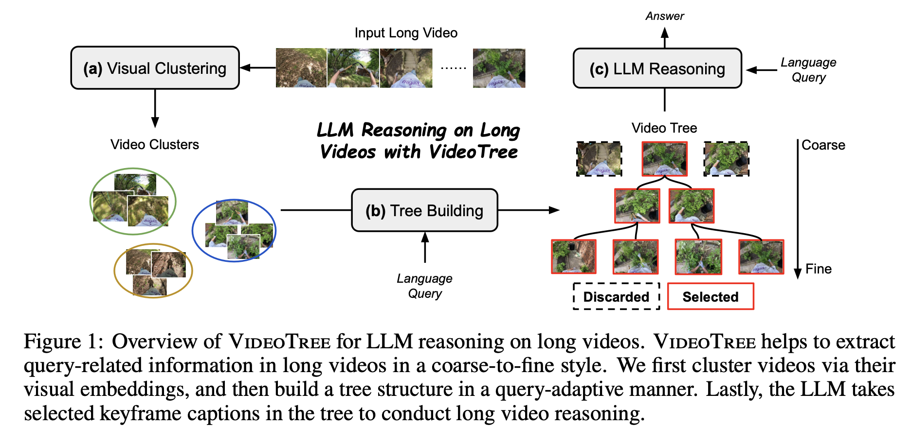
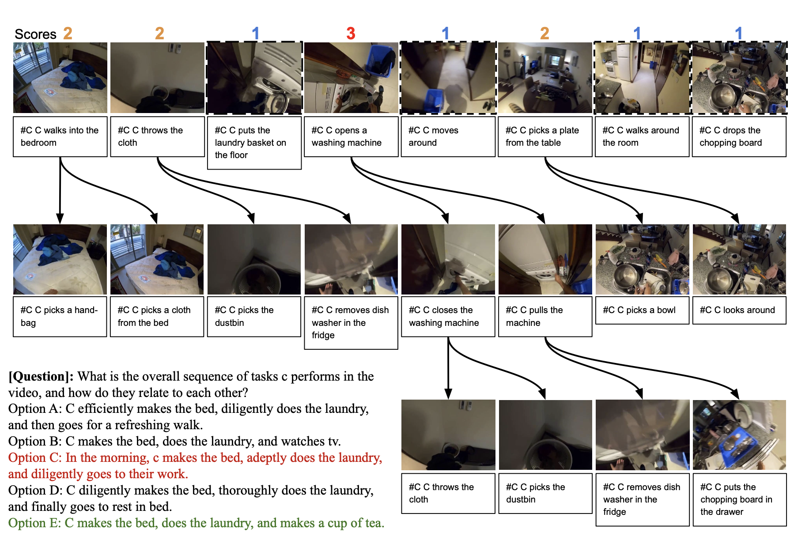

# VideoTree: Adaptive Tree-based Video Representation for LLM Reasoning on Long Videos

This is the official implementation for VideoTree 

[](https://videotree2024.github.io/)  [](https://arxiv.org/abs/2405.19209)

### Authors: [Ziyang Wang*](https://ziyangw2000.github.io/), [Shoubin Yu*](https://yui010206.github.io/), [Elias Stengel-Eskin*](https://esteng.github.io/), [Jaehong Yoon](https://jaehong31.github.io/), [Feng Cheng](https://klauscc.github.io/), [Gedas Bertasius](https://www.gedasbertasius.com/), [Mohit Bansal](https://www.cs.unc.edu/~mbansal/)

### University of North Carolina at Chapel Hill


We introduce VideoTree, a query-adaptive and hierarchical framework for long-video understanding with LLMs. Specifically, VideoTree dynamically extracts query-related information from the input video and builds a tree-based video representation for LLM reasoning.





## **Installation**

**Install environment.**

Python 3.8 or above is required.

```bash
git clone https://github.com/Ziyang412/VideoTree.git
cd VideoTree

python3 -m venv videetree_env
source activate videetree_env/bin/activate
pip install openai
pip3 install torch torchvision torchaudio --index-url https://download.pytorch.org/whl/cu118
pip install pandas
pip install transformers==4.28.1
pip install accelerate
```

**Download dataset annotations and extracted captions.**

Download data.zip from the File [LLoVi](https://drive.google.com/file/d/13M10CB5ePPVlycn754_ff3CwnpPtDfJA/view?usp=drive_link) provided. 

```bash
unzip data.zip
```

You could extract captions for **EgoSchema** at `./data`. It also contains dataset annotations.

Specifically, [LaViLa](https://arxiv.org/pdf/2212.04501.pdf) base model is leveraged to extract EgoSchema captions at 1 FPS.

**Download EgoSchema Videos.**
Please follow [EgoSchema](https://github.com/egoschema/EgoSchema) to download the orginal EgoSchema videos. After downloading, please extract the videos into 1 FPS video frames (save in image format for faster loading speed). Please save in the format of `./data/egoschema_frames/{video_id}/{frame_id}.jpg`. Then, to further speed up the tree building process, we extract the visual features for each frame using [EVA-CLIP-8B](https://huggingface.co/BAAI/EVA-CLIP-8B#eva-clip-8b) and save the features in `./data/egoschema_features/{video_id}.pt`.

```bash
python data_extraction/extract_images.py
python data_extraction/extract_features.py
```

## Update Kmeans-pytorch
Since the orginal Kmeans-pytorch package doesn't set a iteration limit and will cause perpetual loop issue, we update the init file of the original kmeans-pytorch package.

```bash
git clone https://github.com/subhadarship/kmeans_pytorch
cd kmeans_pytorch
```

Please replace the init file in "kmeans_pytorch" folder with the file we provide in "./kmeans_pytorch" folder (this repo). And run the following command. 

```bash
pip install --editable .
```

## Future plans
Due to the limit of time, we are still updating the codebase. We will also incorporate the scipts/captions for NeXT-QA and IntentQA in the future. 


## Experiments


### Adaptive Breath Exapnsion
Please update the feature, asgs (in util.py) and output path before running the code.
```bash

sh scripts/breath_expansion.sh

```

### Relevance-based Depth Expansion

Please update the feature, the output of last step (the relevance output path and first level cluster information) and output path before running the code.
```bash

python depth_expansion.py

```

### LLM Reasoning

Please update the tree node index file (output of last step), data files and output path before running the code.

```bash
sh scripts/egoschema_qa.sh
```


## Debug

```bash
--save_info: save more information, e.g. token usage, detailed prompts, etc.
--num_examples_to_run: how many examples to run. -1 (default) to run all.
--start_from_scratch: ignore existing output files. Start from scratch.
```


## Acknowledgments
We thank the developers of [LLoVi](https://github.com/CeeZh/LLoVi), [LifelongMemory](https://github.com/Agentic-Learning-AI-Lab/lifelong-memory), [EVA-CLIP](https://huggingface.co/BAAI/EVA-CLIP-18B#eva-clip-8b), [Kmeans-pytorch](https://github.com/subhadarship/kmeans_pytorch) and [SKlearn Clustering](https://scikit-learn.org/stable/auto_examples/cluster/plot_ward_structured_vs_unstructured.html) for their public code release. We also thank the authors of [VideoAgent](https://arxiv.org/pdf/2403.10517) for the helpful discussion. 

# Reference
Please cite our paper if you use our models in your works:

```bibtex
@article{wang2024videotree,
  title={VideoTree: Adaptive Tree-based Video Representation for LLM Reasoning on Long Videos},
  author={Wang, Ziyang and Yu, Shoubin and Stengel-Eskin, Elias and Yoon, Jaehong and Cheng, Feng and Bertasius, Gedas and Bansal, Mohit},
  journal={arXiv preprint arXiv:2405.19209},
  year={2024}
}
