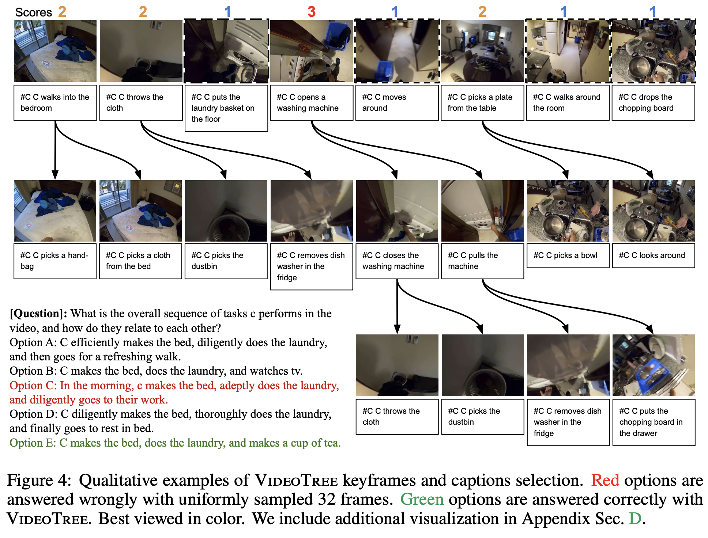

# VideoTree: Adaptive Tree-based Video Representation for LLM Reasoning on Long Videos

This is the official implementation for VideoTree 

[](https://videotree2024.github.io/)  []()

* Authors: [Ziyang Wang*](https://ziyangw2000.github.io/), [Shoubin Yu*](https://yui010206.github.io/), [Elias Stengel-Eskin*](https://esteng.github.io/), [Jaehong Yoon](https://jaehong31.github.io/), [Feng Cheng](https://klauscc.github.io/), [Gedas Bertasius](https://www.gedasbertasius.com/), [Mohit Bansal](https://www.cs.unc.edu/~mbansal/)

* Introduction: We introduce VideoTree, a query-adaptive and hierarchical framework for long-video understanding with LLMs. Specifically, VideoTree dynamically extracts query-related information from the input video and builds a tree-based video representation for LLM reasoning.




## **Installation**

**Install environment.**

Python 3.8 or above is required.

```bash
git clone https://github.com/Ziyang412/VideoTree.git
cd VideoTree

python3 -m venv videetree_env
source activate videetree_env/bin/activate
pip install openai
pip3 install torch torchvision torchaudio --index-url https://download.pytorch.org/whl/cu118
pip install pandas
pip install transformers
pip install accelerate
```

**Download dataset annotations and extracted captions.**

Download data.zip from the File [LLoVi](https://drive.google.com/file/d/13M10CB5ePPVlycn754_ff3CwnpPtDfJA/view?usp=drive_link) provided. 

```bash
unzip data.zip
```

You could extract captions for **EgoSchema** at `./data`. It also contains dataset annotations.

Specifically, [LaViLa](https://arxiv.org/pdf/2212.04501.pdf) base model is leveraged to extract EgoSchema captions at 1 FPS.

## Future plans
Due to the limit of time, the codebase is now under-constructed. We plan to improve the code structure and incorporate the full framework with adaptive width expansion in the future. We will also incorporate the scripts/captions for NExT-QA and IntentQA in the future. 


## Experiments

VideoTree Variant (static tree width  + depth expansion + LLM reasoning) on EgoSchema


### Static Tree Width
Please update the feature and output path before running the code.
```bash

python tree_expansion/width_expansion.py

```

### Relevance Scoring
Please update the path (output of the last step) into the main_rel.py before running the code.


```bash
sh scripts/rel_egoschema.sh
python output_prep/convert_answer_to_pred_relevance.py
```

### Depth Expansion

Please update the feature and output path before running the code.
```bash

python tree_expansion/depth_expansion.py

```

### LLM Reasoning

```bash
sh scripts/egoschema.sh
python output_prep/convert_answer_to_pred.py
```


## Debug

```bash
--save_info: save more information, e.g. token usage, detailed prompts, etc.
--num_examples_to_run: how many examples to run. -1 (default) to run all.
--start_from_scratch: ignore existing output files. Start from scratch.
```


## Acknowledgments
We thank the developers of [LLoVi](https://github.com/CeeZh/LLoVi), [LifelongMemory](https://github.com/Agentic-Learning-AI-Lab/lifelong-memory), [EVA-CLIP](https://huggingface.co/BAAI/EVA-CLIP-18B#eva-clip-8b) for their public code release. We also thank the authors of [VideoAgent](https://arxiv.org/pdf/2403.10517) for the helpful discussion. 


## Reference
If you find this repository useful for your research, please consider citing our work:
```
todo: bibtex
```
